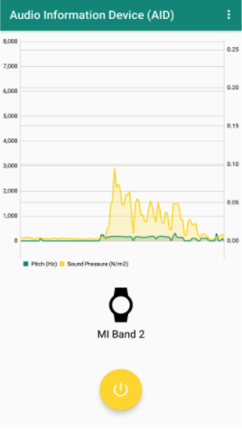
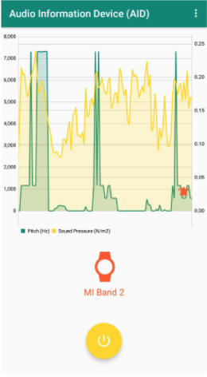

# Audio Information Device (AID)

The AID is a bluetooth device that utilizes an app on the phone to detect certain “dangerous” sounds, namely bicycle bells and car horn sounds.

When a “dangerous” sound is detected, both the phone and band vibrate. This alerts the user of danger and allows him/her to react quickly

We hope it benefits:
- Hearing impaired
- Elderly
- People wearing headphones

#### The app on passive listening mode, when no sound is detected.

#### The app on when a "dangerous" sound is detected, both phone and band vibrates

